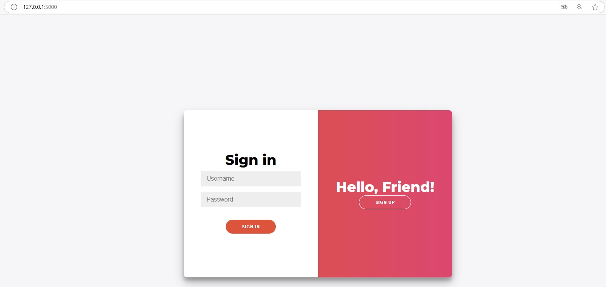
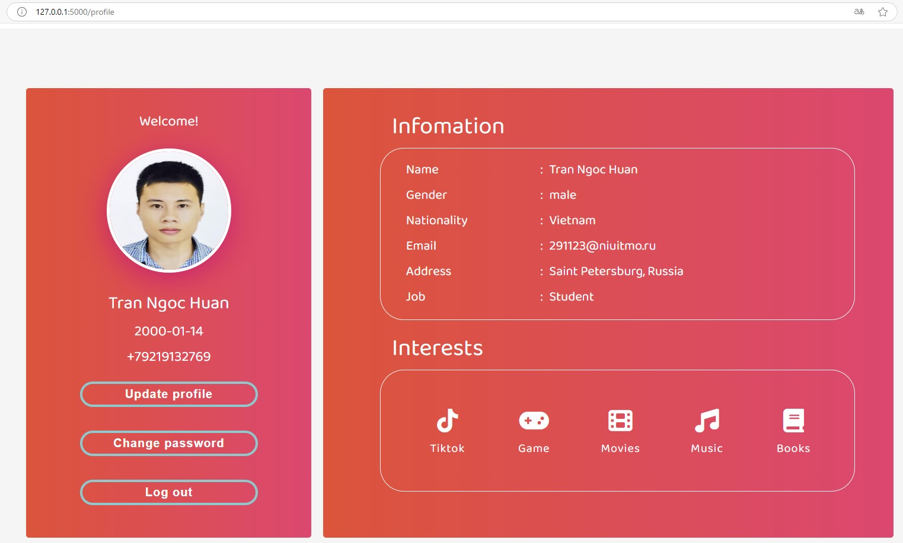
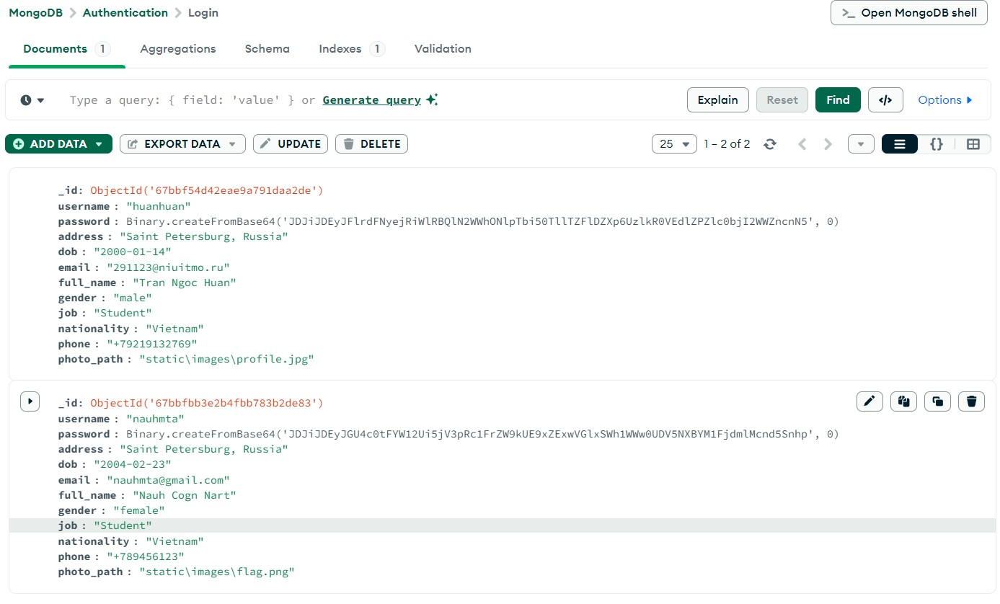
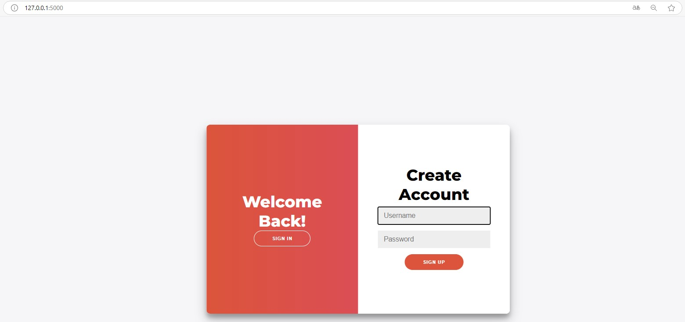
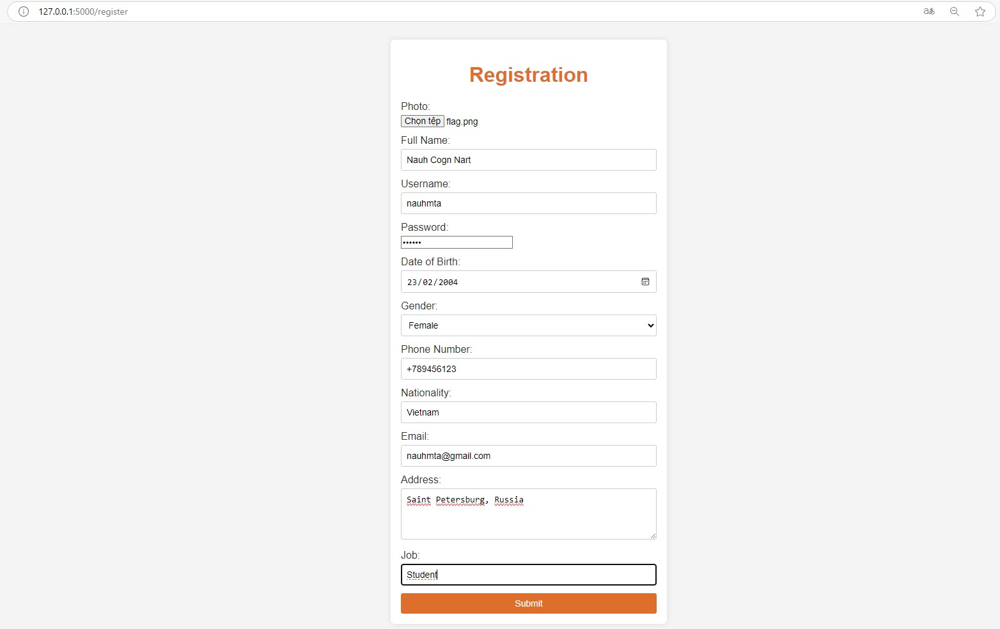
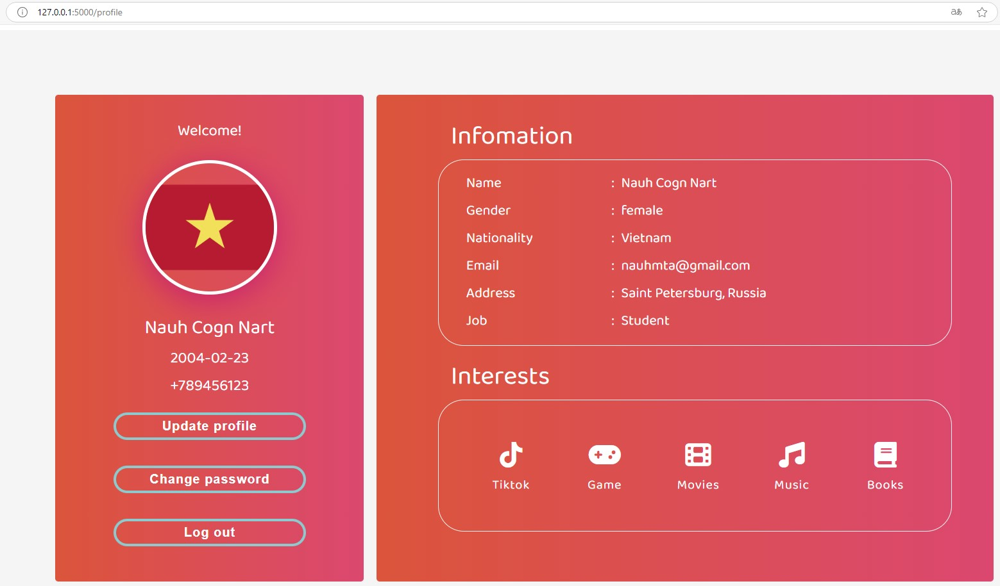
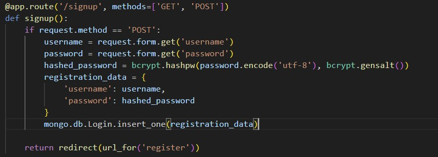
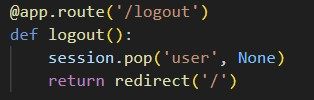

# Authentication Feature Implementation for Web Application

This project implements an authentication feature for a web application, storing user data in a database MongoDB.

## Features

### Basic Authentication

- **Listen on localhost:5000:** The application listens on `localhost:5000`(or the address shown in terminal).
- **Authentication Form:** An authentication form is rendered at `http://localhost:5000/`.
  

- **Redirection:** Upon successful authentication, the user is redirected to profile page at `http://localhost:5000/profile`.
  

- **Data Storage:** Usernames and passwords are stored in MongoDB.
  

### Advanced Features (Optional)

- **User Registration:** Users can create new accounts. Profile data is specific to each account.
  

- **Form Registration:** User enters information to register
  

Profile will be shown with data respected to each account:


- **Password hashing**: Passwords will be hashed before being saved to the database.
  

- **Logout**: When logging out, the page will be redirected to the login confirmation page.
  

## Technologies Used

- Python (Programming Language)
- Flask (Web Framework)
- MongoDB(Database)
- bcrypt (Password Hashing)
- HTML, CSS, JavaScript (Frontend)

## How to Run

1.  **Clone the Repository:**

    ```bash
    git clone [repository URL]
    ```

2.  **Navigate to the Project Directory:**

    ```bash
    cd [project directory name]
    ```

3.  **Install Dependencies:**

    ```bash
    pip install Flask pymongo bcrypt
    ```

4.  **Database Setup:**
    **MongoDB:** Ensure MongoDB is running and configure the connection URI in Python code.

5.  **Run the Application:**
    ```bash
    py app.py
    ```
6.  **Access the application:**
    Open your web browser and navigate to http://localhost:5000 (or the address shown in terminal).
